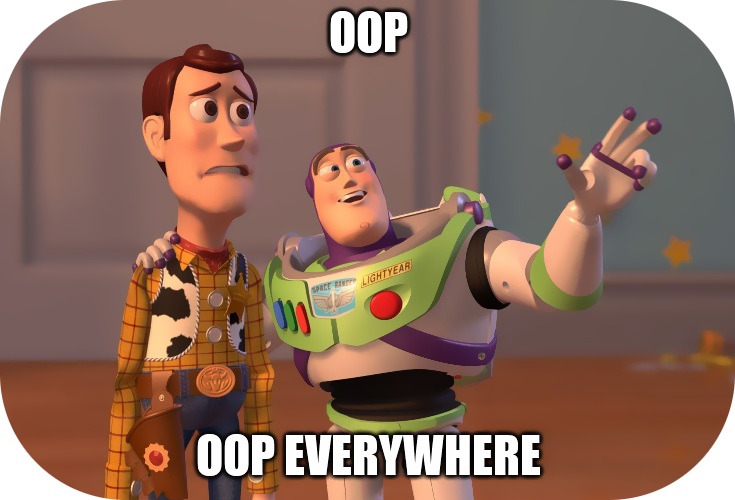

# OOP? More like OP.

Have you heard of OOP? In the 90s, Object-Oriented Programming was quite a thing.
Everyone wanted OOP, more OOP. OOP everywhere.

Well, guess where are we now… everything is OOP.

To the point that a "Hello World" program in Java requires prior OOP knowledge
to understand it. It is a bit sad and funny at the same time.

Thankfully Rust hasn't followed this trend, and we managed to stay out of OOP
(for the most part) until now.

But we just saw Structs and methods. And Sir/Madam, this is already OOP.

Java people will tell you (and me) that Rust doesn't have OOP, and definitely,
what I described here is not OOP by a long, long shot. Never, ever!

Whatever. It is Object-Oriented Programming.

The basics of OOP is that you have something called "Objects" (structs or class), 
and you can spawn many of them. An object has members (variables) and methods 
(functions) associated with them.

That, you already learned.

There's lots more to OOP, like inheritance (which Rust doesn't have), access 
permissions, interfaces, etc. Depends on who defines it, they will say OOP must
have more or less things.

But if you ask me, OOP are structs, members, and methods. That's it. Everything
else is language-dependent.[^1]

You'll learn later on about Rust Traits, that are similar to Java interfaces. 
Also, quite a huge thing in OOP.

Bottom line is that you know already the basics, don't let the OOP herd tell you
otherwise.

[^1]: And they will say I have no idea about OOP, coding or whatever. And I'm
fine with that.
