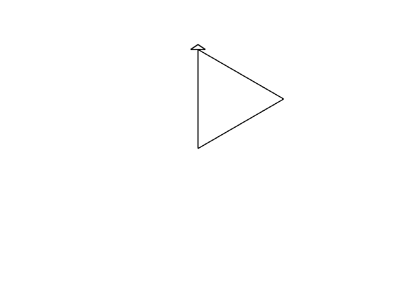
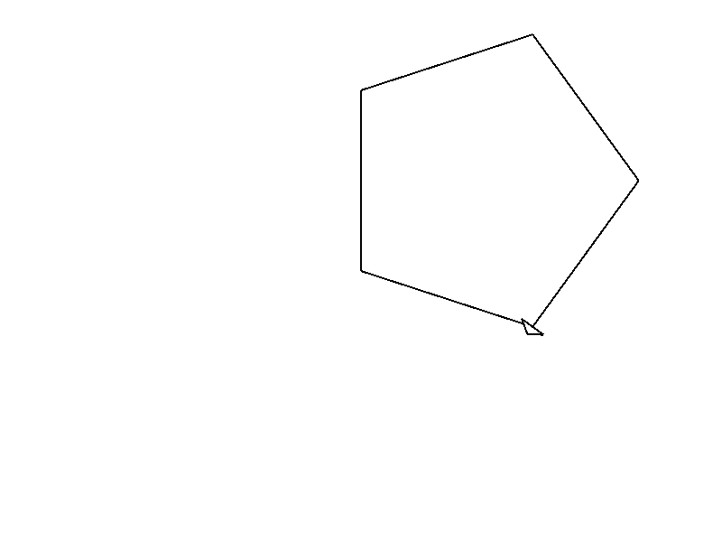

# Let's try Turtle!

For learning purposes, there was a little program called `turtle` in the 80s for
a programming language called LOGO.

This was intended for kids to learn coding. It displayed a little turtle, and
they could send commands such as:

* Move right 30 pixels.
* Move top 30 pixels.
* Move left 30 pixels.
* Move bottom 30 pixels.

And that would create a rectangle on screen.

This is fascinating for learning because there is a visual feedback on the 
screen. And let's face it, the console is booooring.

In Rust, there's a library for this and I think it's worth exploring.

If it doesn't work for you, or if you prefer console, just move on. I'll have
examples for everything in the console.

The library is this one: <https://crates.io/crates/turtle>

What we should do now is add this library as a dependency to our `Cargo.toml`
like this:

```toml
[dependencies]
turtle = { git = "https://github.com/sunjay/turtle.git", tag = "v1.0.0-rc.2" }
```

We just need to add the line[^1] 
`turtle = { git = "https://github.com/sunjay/turtle.git", tag = "v1.0.0-rc.2" }` 
at the end of the file, just below `[dependencies]`.

**BEFORE GOING FURTHER:** Please verify this does work for you. Run `cargo build`
on the terminal and ensure that there are no errors.

Here's what happens on my computer after running this the first time:

```console
$ cargo build
   Compiling lazy_static v1.4.0
   Compiling bitflags v1.3.2
   Compiling byteorder v1.4.3
   Compiling scopeguard v1.1.0
   Compiling cfg-if v0.1.10
   Compiling piston-float v1.0.1
   Compiling rand_core v0.4.2
   Compiling void v1.0.2
   Compiling adler32 v1.2.0
   Compiling downcast-rs v1.2.0
   Compiling piston-graphics_api_version v0.2.0
   Compiling same-file v1.0.6
   Compiling lzw v0.10.0
   Compiling either v1.6.1
   Compiling cty v0.2.2
   Compiling color_quant v1.1.0
   Compiling piston-texture v0.8.0
   Compiling percent-encoding v2.1.0
   Compiling scoped_threadpool v0.1.9
   Compiling read_color v1.0.0
   Compiling interpolation v0.2.0
   Compiling fnv v1.0.7
   Compiling piston-shaders_graphics2d v0.3.1
   Compiling itoa v1.0.1
   Compiling ryu v1.0.9
   Compiling svg v0.6.0
   Compiling libloading v0.6.7
   Compiling lock_api v0.3.4
   Compiling draw_state v0.8.0
   Compiling inflate v0.4.5
   Compiling piston-viewport v1.0.2
   Compiling vecmath v1.0.0
   Compiling rand_core v0.3.1
   Compiling rand_jitter v0.1.4
   Compiling raw-window-handle v0.4.3
   Compiling libc v0.2.125
   Compiling crossbeam-utils v0.8.8
   Compiling maybe-uninit v2.0.0
   Compiling crc32fast v1.3.2
   Compiling shader_version v0.6.0
   Compiling walkdir v2.3.2
   Compiling gif v0.10.3
   Compiling stb_truetype v0.3.1
   Compiling deflate v0.7.20
   Compiling num-traits v0.2.15
   Compiling memoffset v0.6.5
   Compiling libloading v0.5.2
   Compiling dlib v0.4.2
   Compiling rand_hc v0.1.0
   Compiling rand_xorshift v0.1.1
   Compiling rand_isaac v0.1.1
   Compiling crossbeam-channel v0.5.4
   Compiling rand_chacha v0.1.1
   Compiling rand_pcg v0.1.2
   Compiling gfx_core v0.9.2
   Compiling smallvec v0.6.14
   Compiling crossbeam-epoch v0.9.8
   Compiling wayland-sys v0.21.13
   Compiling glutin_egl_sys v0.1.5
   Compiling gfx_gl v0.6.1
   Compiling serde v1.0.137
   Compiling gl v0.11.0
   Compiling dirs-sys v0.3.7
   Compiling nix v0.14.1
   Compiling num_cpus v1.13.1
   Compiling memmap v0.7.0
   Compiling x11-dl v2.19.1
   Compiling raw-window-handle v0.3.4
   Compiling shared_library v0.1.9
   Compiling rand_os v0.1.3
   Compiling parking_lot_core v0.6.2
   Compiling png v0.15.3
   Compiling crossbeam-deque v0.8.1
   Compiling dirs v4.0.0
   Compiling rand v0.6.5
   Compiling osmesa-sys v0.1.2
   Compiling ordered-float v1.1.1
   Compiling approx v0.3.2
   Compiling line_drawing v0.7.0
   Compiling num-integer v0.1.45
   Compiling tiff v0.3.1
   Compiling parking_lot v0.9.0
   Compiling rayon-core v1.9.3
   Compiling xdg v2.4.1
   Compiling rusttype v0.8.3
   Compiling num-rational v0.2.4
   Compiling num-iter v0.1.43
   Compiling gfx v0.18.2
   Compiling gfx_device_gl v0.16.2
   Compiling rusttype v0.7.9
   Compiling andrew v0.2.1
   Compiling piston2d-graphics v0.35.0
   Compiling rayon v1.5.3
   Compiling glutin_glx_sys v0.1.7
   Compiling pistoncore-input v0.28.1
   Compiling serde_json v1.0.81
   Compiling wayland-commons v0.21.13
   Compiling wayland-client v0.21.13
   Compiling jpeg-decoder v0.1.22
   Compiling pistoncore-window v0.44.0
   Compiling pistoncore-event_loop v0.49.0
   Compiling wayland-protocols v0.21.13
   Compiling piston v0.49.0
   Compiling image v0.22.5
   Compiling smithay-client-toolkit v0.4.6
   Compiling piston-gfx_texture v0.40.0
   Compiling piston2d-gfx_graphics v0.66.0
   Compiling winit v0.19.5
   Compiling glutin v0.21.2
   Compiling pistoncore-glutin_window v0.63.0
   Compiling piston_window v0.105.0
   Compiling turtle v1.0.0-rc.3
   Compiling learnrust v0.1.0 (/home/deavid/git/rust/lprfl/learnrust)
    Finished dev [unoptimized + debuginfo] target(s) in 14.61s
```

If we run it again, it will be much shorter. This is correct:
```
$ cargo build
    Finished dev [unoptimized + debuginfo] target(s) in 0.03s
```

[^1]: I had to use the Git repository and the tag `v1.0.0-rc.2` because 
`v1.0.0-rc.3` which is the latest one crashes for me, and just specifying the
RC version doesn't seem to be something that Cargo likes for this package.

# Testing Turtle

Let's begin by creating a file `turtle_vars.rs` in `learnrust/src/bin/` and
place the following example code inside:

```rust
use turtle::Turtle;

fn main() {
    let mut turtle = Turtle::new();

    turtle.forward(10.0);
}
```

Now, remember that we have to add this program into `Cargo.toml`:

```toml
[[bin]]
name = "turtle_vars"
```

And now, let's test this:

```console
$ cargo run --bin turtle_vars
```

This should display a window like this:


If this is what you see, congrats! It works for you!

# Drawing a rectangle

As explained at the beginning, we just need a few commands to do this.

Basically, we can tell the turtle to turn right while moving, and if done
in four steps, we should get a rectangle:

```rust
    turtle.forward(100.0);
    turtle.right(90.0);
    turtle.forward(100.0);
    turtle.right(90.0);
    turtle.forward(100.0);
    turtle.right(90.0);
    turtle.forward(100.0);
```

And this gives us a nice animation. The end result is:


But wait! What does `100.0` mean? And `90.0`?

The first one is the distance to move, the second one is the angle to turn.

So the program really says:

* Walk forward 100 pixels.
* Turn right 90 degrees.
* Now walk forward again 100 pixels.
* Turn right again 90 degrees.
* Walk again 100 pixels.
* Right by 90 degrees.
* Walk 100 pixels.

But to someone reading the program it might be confusing to understand.

Also, what if we want to make the rectangle bigger or smaller? We would need
to change the `100.0` in all four places. That's a lot of work!![^2]

So let's use variables to prevent repetition:

```rust
    let distance = 100.0;
    let angle = 90.0;

    turtle.forward(distance);
    turtle.right(angle);
    turtle.forward(distance);
    turtle.right(angle);
    turtle.forward(distance);
    turtle.right(angle);
    turtle.forward(distance);
```

Nice! Now if we want to make it bigger we just change:

```rust
    let distance = 200.0;
    let angle = 90.0;
```

But what happens if we change the angle? Let's try it out!

```rust
    let distance = 200.0;
    let angle = 120.0;
```



It draws a triangle! Wait, what?!

That's because a regular polygon has their sides separated by an angle defined by:

\\[angle = 360 / sides \\]

And \\(360/3=120\\), so 120 degrees is just a triangle.

Wait a second… can we make this, so it can do different polygons?

Sure! First we copy the `forward` and `right` commands a few times more:

```rust
    let distance = 200.0;
    let angle = 120.0;

    turtle.forward(distance);
    turtle.right(angle);
    turtle.forward(distance);
    turtle.right(angle);
    turtle.forward(distance);
    turtle.right(angle);
    turtle.forward(distance);
    turtle.right(angle);
    turtle.forward(distance);
    turtle.right(angle);
    turtle.forward(distance);
    turtle.right(angle);
    turtle.forward(distance);
    turtle.right(angle);
    turtle.forward(distance);
    turtle.right(angle);
    turtle.forward(distance);
```

Now we can compute the angle by using the formula:

```rust
    let sides = 5.0;
    let distance = 200.0;
    let angle = 360.0 / sides;
```

And we get a new figure:



Try playing yourself with the values and see what happens each time. 

* What happens if we put `sides = 10.0` and `distance = 50.0`? Why?
* What happens if we change `angle = 300.0` and `sides = 8.0`?
* And `angle = 315.0` and `sides = 5.0`?

-----------
[^2]: Yes, we programmers are lazy. How could you have guessed that?

## That's it!

Well done. Hope you enjoyed this.

Yes, there's still a lot of repetition in the code, 
but well get to that very soon.

Here's the full program:

```rust
{{#include ../../learnrust/src/bin/turtle_vars.rs}}
```